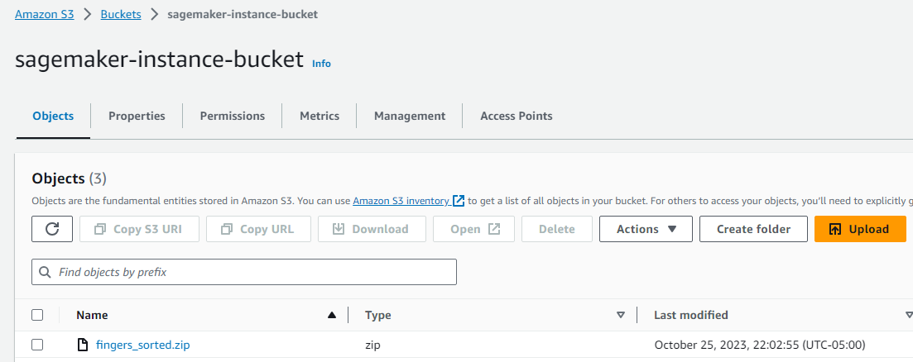
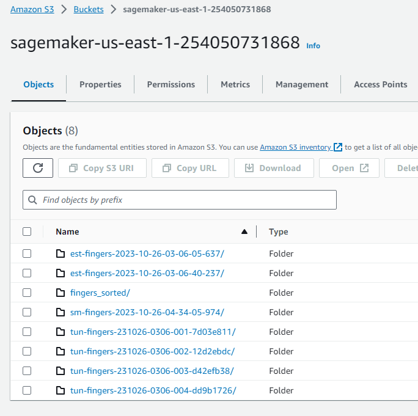
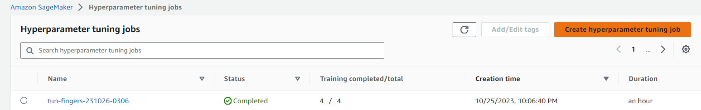
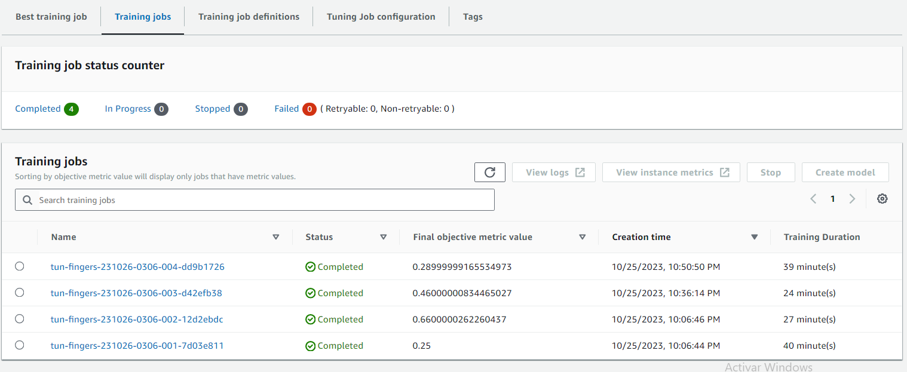
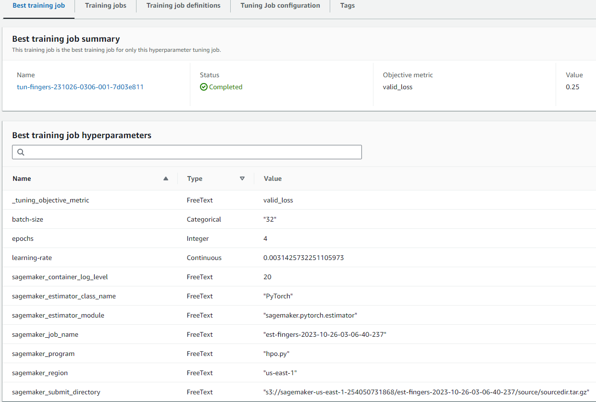
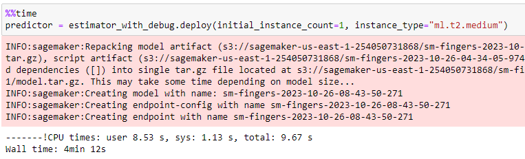
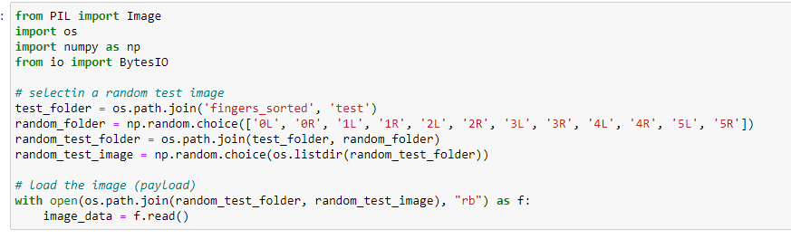
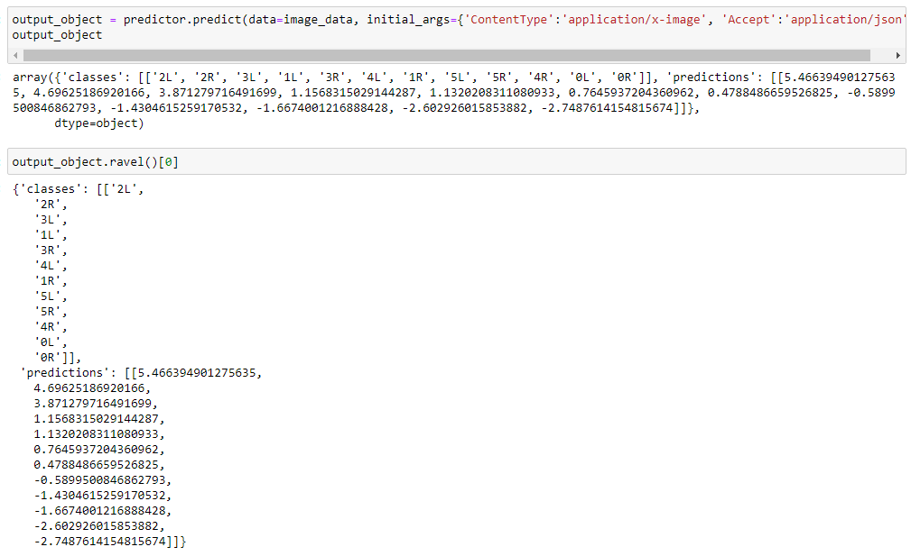
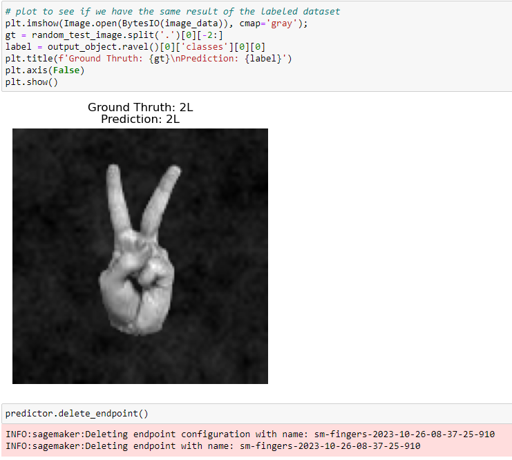
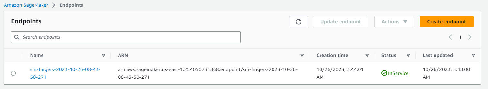

 <b>Project Overview: Image Classification using AWS SageMaker and Kaggle Fingers Dataset<b>

In this project, we will be using AWS Sagemaker to finetune a pretrained model that can perform image classification. We will have to use Sagemaker profiling, debugger, hyperparameter tuning and other good ML engineering practices to finish this project. We are using the Kaggle Fingers dataset that consists on grayscale one channel images.

 <b>How It Works<b>

The goal of the project is to build a model able to count fingers as well as distinguish between left and right hand.

21600 images of left and right hands fingers.

- All images are 128 by 128 pixels.
- Training set: 18000 images (14400 training images + 3600 validation images)
- Test set: 3600 images
- Images are centered by the center of mass
- Noise pattern on the background

For this project, we will use VGG16, a pretrained neural network to make fingers classification using PyTorch.

Once we have trained the model (using hyperparameter tuning), we will need to deploy the model to a Sagemaker Endpoint. To test your deployment, we also need to query the deployed model with a sample image and get a prediction.

#### Pipeline

We will have to perform tasks and use tools that a typical ML Engineer does as a part of their job. Broadly, our project has 3 main steps:

- Start with Data Preparations where the training data is put into a S3 bucket. 
- Next in Training, there is hyperparameter tuning, which leads to training the models and outputs a Profiler, Model, and Debugger report. 
- Finally in deployment there is deployment and testing. 

#### Project Pipeline

As an ML Engineer, we will need to track and coordinate the flow of data (which could be images, models, metrics etc) through these different steps. The goal of this project is to train an accurate model, but to set up an infrastructure that enables other developers to train such models.

We will go over your tasks for each of these steps in more detail over the next few pages.

Useful Links:
- [How to Finetune a Pytorch Model](https://pytorch.org/tutorials/beginner/finetuning_torchvision_models_tutorial.html)
- [How to finetune a TensorFlow Model](https://www.tensorflow.org/tutorials/images/transfer_learning)

 <b>Project Set Up and Installation<b>

Enter AWS through the gateway in the course and open SageMaker Studio. 
Download the starter files.
Download/Make the dataset available. 

 <b>Dataset<b>

The provided dataset is the Kaggle Fingers Dataset for classification which can be found in [here](https://www.kaggle.com/datasets/koryakinp/fingers).
The project is designed to be dataset independent so if there is a dataset that is more interesting or relevant to your work, you are welcome to use it to complete the project.

 <b>Access<b>

Upload the data to an S3 bucket through the AWS Gateway so that SageMaker has access to the data.

Look at the results on the default bucket.

 <b>Files and Folders<b>

- **doc**: contains the images referenced here.
  - *png_images*: image for reference on the document.
- **code**: contains the python files for hyperparameter optimization, training and deployment.
  - *hpo.py*: hyperparameter tunning file.
  - *train_model.py*: for debuging, profiling and deployment.
  - *requirements.txt*: if you want to install dependencies on the docker container.
- **ProfileReport**: The complete profiler and debugger output file.
- **fingers**: not listed here, has the training and test set downloaded and extracted from kaggle.
- **fingers_sorted**: not listed here, has the training, test and validation sets. 
- **Data Exploration.ipyng**: notebook containing the exploratory data analysis over the dataset and sorting.
- **Torch Model - Transfer Learning.ipynb**: notebook for developing the pipeline locally before using sagemaker PoC (Proof of concept)
- **train_and_deploy.ipynb**: notebook with the complete solution of the pipeline.
- **train_and_deploy.html**: same notebook as above but in html output.
- **train_and_deploy.pdf**: same notebook as above but in pdf format.
- **info_train.csv**: how was distributed the training set.
- **info_valid.csv**: how was distributed the validation set.
- **info_test.csv**: how was distributed the test set.
- **README.md**: This file, explanation of the project

 <b>Hyperparameter Tunning<b>

Choosen Model:
- We choose a VGG16 model that is a pre-trained neural network with imagenet v1 weight files.

Overview of the Hyperparameters and their use:
- Learning Rate: it controls how much change the model in response ot the estimated error each time in the model weights; determines the step size at each iteration whule moving toward a minimun of a loss function.
- Batch Size: controls the number of training samples to work through before the model's internal parameter update.
- epochs: refers to one time passing of all training data over the network.

Training Jobs

Log Metrics

Tunned Hyperparameters

 <b>Debugging and Profiling<b>

Over the notebook, the rules, profiler and configurations of debugger were set, also we set up the estimator and enable the hooks on the .py file to log the information.

 <b>Results<b>

At first we saw the model will needing the GPU for training and also the time for training must not be needed as much too, we then switched to CPU and only for 4 epochs is enough, this gives us less cost through the sagemaker pipeline but sacrifices the time of training.

The debugger and profiler report is uploaded in this repository to check the outputs.

 <b>Model Deployment<b>

Model Deployment and Query Input.

Screenshot of active endpoint in Sagemaker.

 <b>Standout Suggestions [OPTIONAL]<b>

- 🚧 Package Your Model: Pack the model as a Docker Container so that it can be easily deployed. 
- 🚧 Multi-Model Endpoint: Finetune multiple (different) pretrained models and try to deploy them to the same endpoint in the form of a Multi-Model Endpoint.
- 🚧 Batch Transform: Create a batch transform that performs inference on the whole test set together.
- 🚧 Model Explainability: Use Amazon Sagemaker Clarity to make your models more interpretable.

 <b>Video Explanation<b>

Fingers classification using AWS Sagemaker and Kaggle Dataset

 <b>Contributing<b>

Your contributions are always welcome! Please feel free to fork and modify the content but remember to finally do a pull request.

 :iphone: <b>Having Problems?<b>

 

 <b>License<b>

